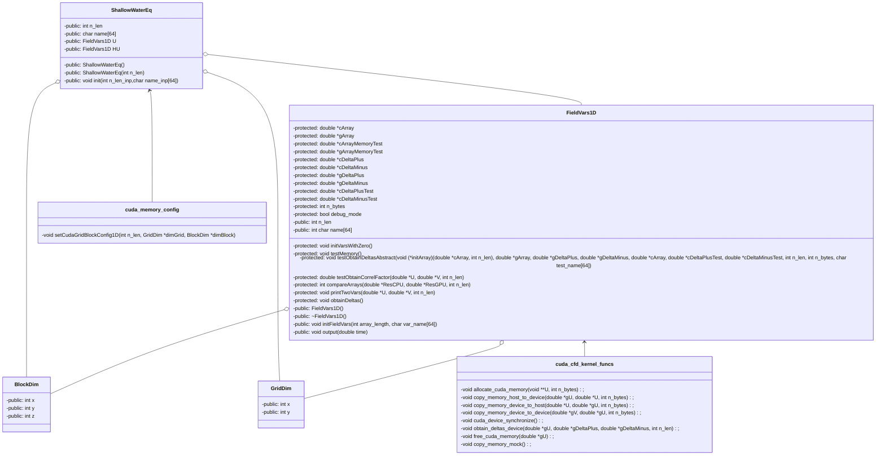

# CFD for CUDA documkents

## Configuration of the program

## Reference documts

https://http.download.nvidia.com/developer/cuda/jp/CUDA_Programming_Basics_PartI_jp.pdf
https://http.download.nvidia.com/developer/cuda/jp/CUDA_Programming_Basics_PartII_jp.pdf

https://docs.nvidia.com/cuda/cuda-math-api/group__CUDA__MATH__SINGLE.html

https://tech-blog.optim.co.jp/entry/2019/08/15/163000

https://co-crea.jp/wp-content/uploads/2016/07/File_2.pdf
